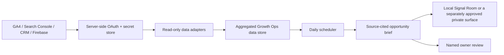

# Growth Ops integration contract

This document is the checklist before any agent is allowed to read live MakerLab growth data. It is deliberately narrow: agent access is read-only unless an owner approves a separate action workflow.

## Minimum sources and permissions

| Source | What the console needs | Minimum permission | Do not grant |
| --- | --- | --- | --- |
| Google Analytics 4 | Read aggregate acquisition, journey and conversion event data | Viewer on the selected GA4 property | Administrator, Editor, billing |
| Google Search Console | Read search queries, pages, clicks, impressions and coverage | Full user on the selected property | Owner unless verification/admin work is required |
| Firebase reporting | Read the approved lead/booking aggregates and event exports | Scoped server-side account, only approved reporting collections | Firebase project Owner or broad production writes |
| CRM / WhatsApp pipeline | Read status, source and enrollment outcome aggregates | Read-only reporting seat or scoped API token | Messaging/send rights, contact exports by default |
| Google Business Profile | Read local discovery actions and performance | Manager on the selected profile | Primary owner |

Google Business Profile does not offer a strict read-only manager role: a Manager may make operational changes. Keep this integration separate, grant it only with owner approval, and do not allow unattended writing actions.

## Secure connection requirements

1. A named MakerLab owner approves each source and scope.
2. Use a dedicated OAuth client or service account. Store its secrets only in the hosting environment or dedicated secret manager.
3. Do not expose secrets in Vite variables prefixed with `VITE_`, browser local storage, Firestore public collections, Git, screenshots, or chat.
4. Apply a documented data-retention period. Aggregate by default; named child and lead records need a defined support or enrollment purpose.
5. Write an audit record for who connected, what scope was granted, last successful refresh, and connection failure owner.
6. Revoke access when a staff member, agent, or vendor leaves the workflow.

## Server-side architecture to implement

The current localhost Signal Room only writes non-sensitive operating context to `docs/ops/`; it does not query providers. If a live-data system is approved later, the private surface reads a protected aggregate/reporting endpoint and never calls provider APIs with a browser credential.

## Daily brief contract

The daily job may run only after every source has an owner and health check. Each brief must include:

- source freshness and unavailable sources;
- traffic and conversion changes with an explicit comparison window;
- the highest-confidence opportunity with impact, effort, owner and due date;
- evidence links/query segments behind the recommendation;
- a risk/consent note when the recommendation touches lead data;
- the outcome of the previous action when enough time has passed.

It must not claim an LLM or Google ranking guarantee, invent a source value, modify campaigns/content automatically, or message a lead without an approved human workflow.
